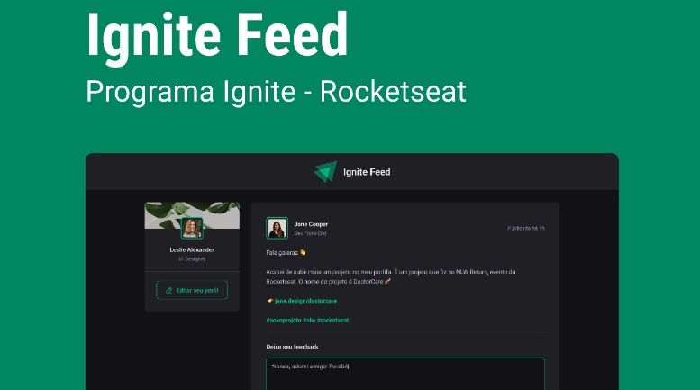

<h1 align="center"> Ignite Feed </h1>

Programa exclusivo e gratuito, promovido pela Rocketseat para ensino de tecnologias WEB.

  <a href="#-tecnologias">Tecnologias</a>&nbsp;&nbsp;&nbsp;|&nbsp;&nbsp;&nbsp;
  <a href="#-projeto">Projeto</a>&nbsp;&nbsp;&nbsp;|&nbsp;&nbsp;&nbsp;
  <a href="#-layout">Layout</a>&nbsp;&nbsp;&nbsp;|&nbsp;&nbsp;&nbsp;
  <a href="#memo-licença">Licença</a>

  

 

  

## 🚀 Tecnologias

Esse projeto foi desenvolvido com as seguintes tecnologias:

- React
- TypeScript
- HTML e CSS
- JavaScript
- Figma

## 💻 Projeto

O projeto consiste na criação de uma plataforma que replica uma rede social, oferecendo uma linha do tempo (timeline) repleta de diversos posts. Os usuários têm a capacidade de interagir com esses posts de variadas maneiras, incluindo a possibilidade de realizar comentários, dar "likes" e também remover posts conforme desejarem.

## 🔖 Layout

Você pode visualizar o layout do projeto através [DESSE LINK](<https://www.figma.com/design/UDuyfSKReJQB5tHIsa9p5K/Ignite-Feed-(Community)?node-id=0-1&t=0xYFnioy9uwFG3hI-0>). É necessário ter conta no [Figma](https://figma.com) para acessá-lo.

## :memo: Licença

Esse projeto está sob a licença MIT.
